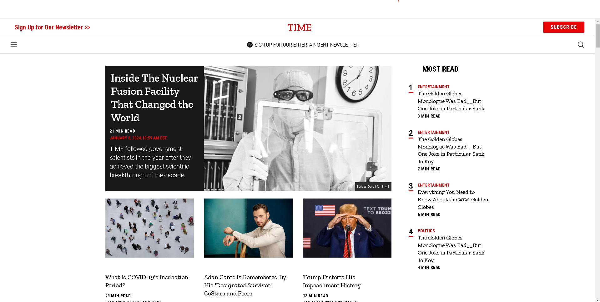
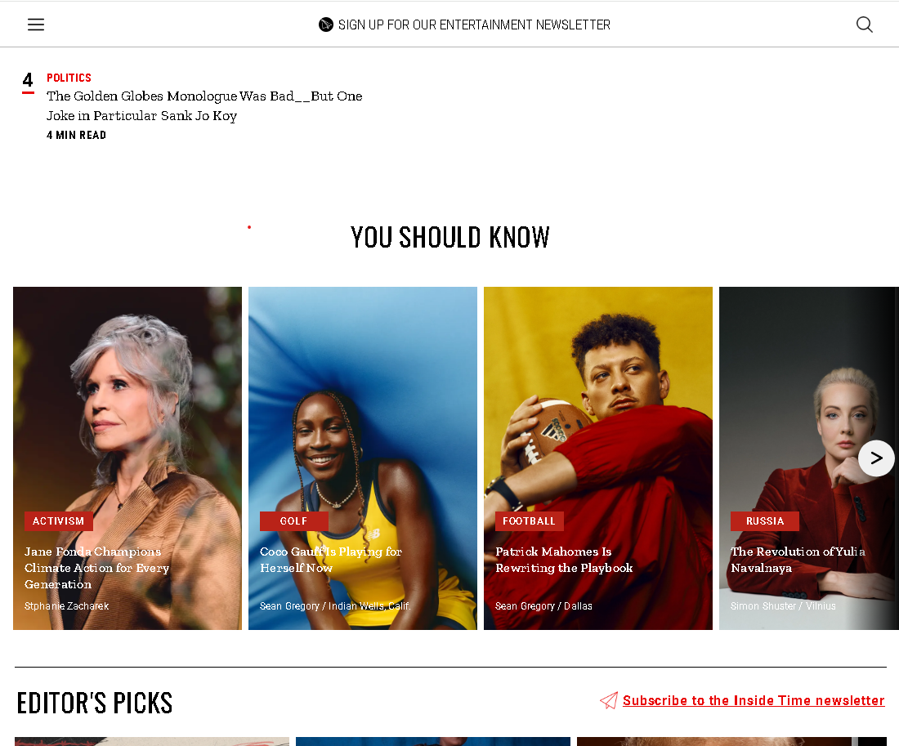

# TIME.com website practice

## 概述

這個作品展示了基礎 react 的應用，包含 react hooks 還有 react components 以及 responsive web design 的展示。

## 功能

- 使用 addEventListener 監聽滑鼠滾動，當頁面向下滾動會收起 title 欄位，當頁面往上會回復 title 欄位
- 紀錄滾動頁面位址，當側邊欄彈出時強制固定畫面並在收闔側邊欄時回復至滾動位址
- 側邊欄動畫
- 在螢幕大小為 768px 至 1161px 時改變 css 增加卡面左右輪播控制按鈕
- 在螢幕大小小於 768px 時 增加卡面左右輪播顯示圓圈以及增加行動裝置的拖曳更換卡面功能

## 畫面預覽





## 資料夾說明

- picture - 預覽畫面
- audios - 音檔
- components - 各種組件
- controller - 公共函式
- icon - 圖檔
- styles - css

## 取得專案

```
https://github.com/CatYunnnn/time_website_copy.git
```

## 安裝所需套件

```
npm install
```

## 啟動專案

```
npm start
```

## 開發工具

- react 18.2.0

## 如果有任何建議或合作的機會，請透過<marco20001114@gmail.com>聯繫我
